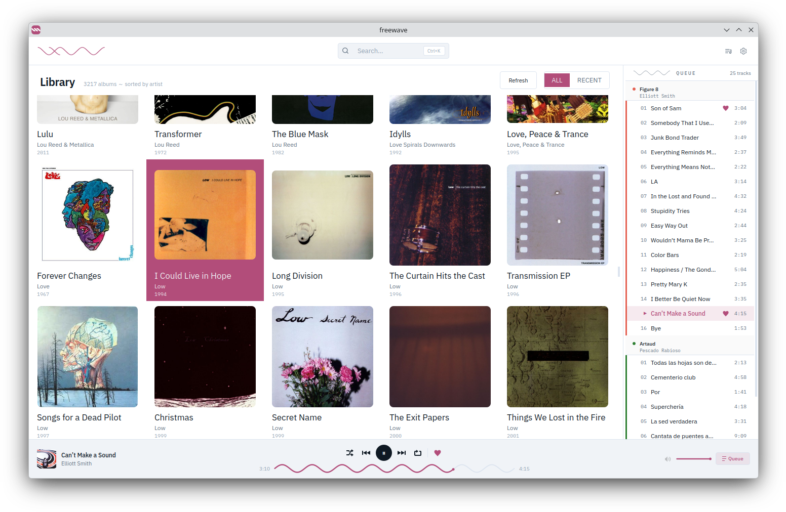
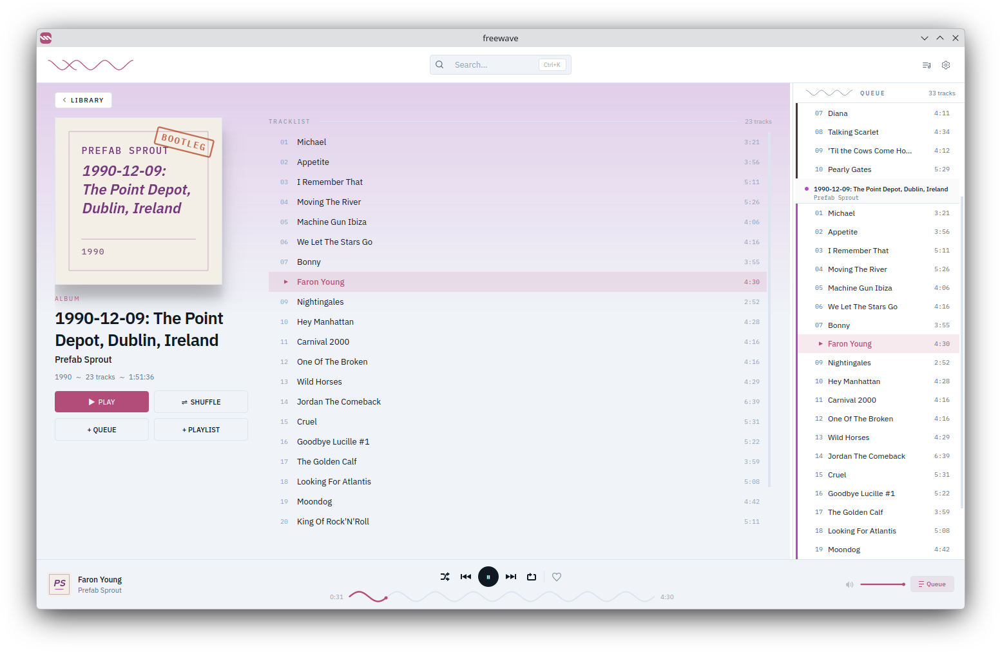
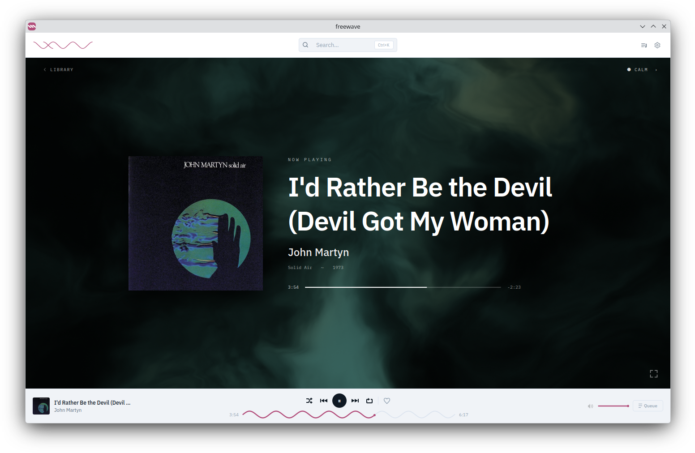
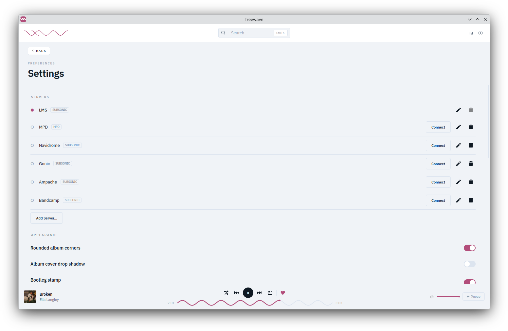

# freewave

freewave is an album-focused Subsonic/MPD GUI for the X Window System not written in Python.



## GOALS
freewave was written with the following principles in mind:

### ALBUM COVER VIEW SHOULD BE FAST
i want to be able to whizz through my collection's beautiful album covers
as fast as my scroll wheel can handle. this is currently achieved by pre-computing
thumbnails from mpd and caching them with `QPixmapCache` as they are used.

### IT SHOULD BE ALBUM-FOCUSED AND NOT UGLY
unlike other self-proclaimed beautiful software, freewave understands that beauty
is in the eye of the beholder. as such, it aims to be functional and not ugly.

the main window will never have a lyrics panel, an artist info panel, or any of the
other useless, UI cluttering garbage that plagues GNU+Linux music players.

albums are sorted by artist > date > title. if you prefer your albums sorted by title,
then i'm pretty sure you don't even listen to music so move along.

### LINUX ONLY
too much of what runs on linux was designed for another platform and ported over
as an afterthought. linux deserves excellent software of its own, and freewave is
written for it first and only.

## FEATURES

 * album cover grid that scrolls as fast as your scroll wheel can handle
 * MPD and Subsonic/OpenSubsonic backends, with server profiles and live switching
 * playlists, with drag-to-reorder
 * per-song favorites, stored natively on the server (MPD stickers / Subsonic stars)
 * MPRIS, for desktop media keys and widgets
 * a fullscreen Now Playing screen with audio visualizers
 * gapless playback and an on-disk track cache on the Subsonic backend
 * typographic jackets for albums with no cover art
 * system tray icon, optional close-to-tray

## SCREENSHOTS

| | |
|---|---|
|  |  |
| an album, with its track list | now playing |
|  | |
| server profiles in settings | |

## INSTALLING
packages for Debian and Ubuntu, a flatpak, or building from source: see
[INSTALL.md](INSTALL.md).

## USING

### CONNECTING TO A SERVER

when adding a Subsonic/OpenSubsonic server, freewave asks for either an **API
Key** or a **Username/Password**. which one to pick depends on the server:

| Server | Auth option to use |
|---|---|
| LMS ([epoupon/lms](https://github.com/epoupon/lms)) | API Key |
| Navidrome | Username/Password |
| Gonic | Username/Password |
| Ampache | API Key |
| Bandcamp | Username/Password |
| most other Subsonic/OpenSubsonic servers | Username/Password |

if you run the flatpak and your MPD uses a unix socket instead of TCP, you'll need
to grant access to it:

```
flatpak run --filesystem=xdg-run/mpd org.xeyes.Freewave
```

### KEYBOARD SHORTCUTS

 * `SPACE` - play/pause
 * `CTRL + SPACE` - stop
 * `CTRL + LEFT` - previous
 * `CTRL + RIGHT` - next
 * `CTRL + K` (or `CTRL + F`) - search
 * `CTRL + L` - scroll to the playing album
 * `F11` - fullscreen Now Playing (while it's open: `F` toggles, `ESC` leaves)
 * `L` - love the current track (while Now Playing is open)

## LIMITATIONS
identified limitations, suggestions welcome

### GROUPING BY ALBUMS IS HARD
mpd has no concept of an album so educated guesses are made based on media tags:
the MusicBrainz release id when a file has one, otherwise albumartist/date/title.

 * requires good tags
 * an album with inconsistent tags shows up as more than one album

### RECENT SHOWS MODIFIED RATHER THAN ADDED
mpd doesn't track when a song was added to the database, only when it was last modified.
this is not ideal because the recent tab should show recently added items.

 * could keep track of added time in-app rather than rely on mpd

### KDE SHOWS A MICROPHONE INDICATOR
with the MPD backend the visualizer reads the PipeWire monitor of your output
device, which KDE reports with the same indicator as a microphone. nothing is
recorded. the Subsonic backend taps its own playback pipeline and does not
trigger it.

## TROUBLESHOOTING

### DOES THIS WORK ON WINDOWS
the software was written for Linux but some users on the forum have had luck
[getting it running on Windows](https://goatse.cx/).

## FUTURE PLANS
 * scrobbling
   * in the meantime, [mpris-scrobbler](https://github.com/mariusor/mpris-scrobbler)
 * configurable album cover size
 * tag editing
 * tracklist expands in list rather than separate view
 * more visualizers, possibly a projectM backend
 * user-provided Now Playing screens (the scene is QML)
 * deal with multi discs
 * when deleting items in the queue, select the previous item (or next if there is no previous)
 * make less ugly

## ACKNOWLEDGEMENTS
freewave uses [libmpdclient](https://www.musicpd.org/libs/libmpdclient/) to talk
to MPD, [GStreamer](https://gstreamer.freedesktop.org/) to play Subsonic streams,
[KissFFT](https://github.com/mborgerding/kissfft) for the visualizer, and
[spdlog](https://github.com/gabime/spdlog) for logging.

## LICENSE
GPL-3.0-or-later. the full text is in [LICENSE](LICENSE).
